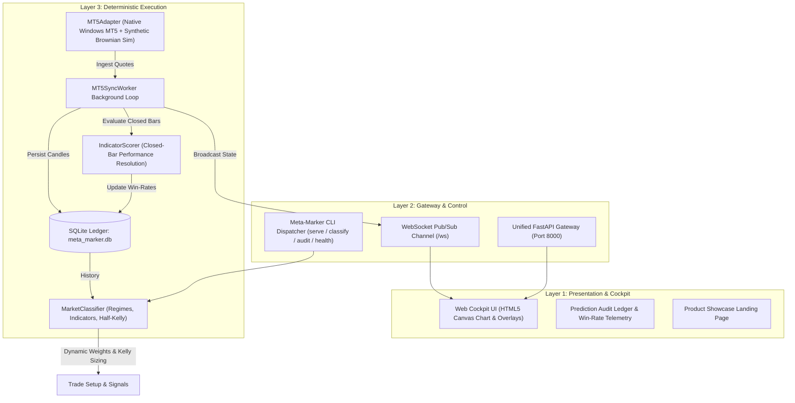

# Meta-Marker: Market Intelligence Engine (MIE)

<div align="center">

[](https://www.python.org/)
[](https://fastapi.tiangolo.com/)
[](https://github.com/MuzikayiseKhuzwayo/meta-marker/blob/main/LICENSE)
[](https://github.com/MuzikayiseKhuzwayo/meta-marker)
[](https://github.com/MuzikayiseKhuzwayo/meta-marker)

**Deterministic market regime classification, dynamic reliability weighting, and real-time MetaTrader 5 / Synthetic simulation streaming.**

[Product Showcase](https://github.com/MuzikayiseKhuzwayo/meta-marker/blob/main/showcase/index.html) &bull; [Quickstart](#quickstart-in-3-steps) &bull; [Documentation](#documentation-diátaxis-framework) &bull; [CLI Reference](#unified-command-line-interface)

</div>

---

## Executive Overview

Most algorithmic trading systems fail over time because they apply static indicator thresholds across shifting market regimes. Moving averages get chopped in consolidations; oscillators get trapped during relentless trends.

**Meta-Marker** solves this by decoupling **Regime Detection** from **Indicator Weighting**:
1. **Deterministic Market Regimes:** Identifies *Trend Following* vs. *Mean Reversion*, multi-tier volatility, and momentum dynamics.
2. **Empirical Dynamic Reliability:** Audits the predictive accuracy of individual indicators (EMAs, RSI, MACD, Stochastic, Market Structure BOS) continuously across closed bars and weights their consensus in real-time.
3. **Half-Kelly Capital Allocation:** Computes mathematically grounded position risk sizing bounded by institutional safety limits (0.0% – 5.0%).
4. **Universal Portability Bridge:** Runs natively with MetaTrader 5 on Windows, and falls back gracefully to a high-fidelity **Synthetic Market Feed** on Linux, macOS, and headless CI/CD runners.
5. **Glassmorphic Multi-View Cockpit:** Features a cyberpunk web dashboard with interactive candlestick pan/drag charts, live prediction audit ledgers, and telemetry diagnostics.

---

## Target 3-Tier Architecture



---

## Quickstart in 3 Steps

### 1. Clone & Synchronize Dependencies
```bash
git clone https://github.com/MuzikayiseKhuzwayo/meta-marker.git
cd meta-marker

# Install dependencies into an isolated virtual environment
uv sync
```

### 2. Launch the Unified Cockpit
```bash
uv run meta-marker serve --port 8000
```
Open **[http://127.0.0.1:8000](http://127.0.0.1:8000)** in your browser.

### 3. Run One-Shot Headless Analysis
```bash
uv run meta-marker classify --symbol XAUUSD --timeframe M15
```

---

## Documentation (Diátaxis Framework)

Meta-Marker's documentation is strictly organized into the four Diátaxis quadrants:

| Quadrant | Document | Description |
| :--- | :--- | :--- |
| **Tutorials** | [Zero-to-One Quickstart](https://github.com/MuzikayiseKhuzwayo/meta-marker/blob/main/docs/tutorials/01-zero-to-one-quickstart.md) | 10-minute learning walkthrough for beginners |
| **How-To Guides** | [Connect Live MT5 Broker](https://github.com/MuzikayiseKhuzwayo/meta-marker/blob/main/docs/how-to/01-connect-mt5-broker.md) | Linking local MT5 terminals on Windows via DLL |
| | [Headless & Synthetic Simulation](https://github.com/MuzikayiseKhuzwayo/meta-marker/blob/main/docs/how-to/02-running-headless-synthetic-mode.md) | Running on Linux, Docker, or macOS without MT5 |
| | [Custom Indicator Integration](https://github.com/MuzikayiseKhuzwayo/meta-marker/blob/main/docs/how-to/03-custom-indicator-integration.md) | Registering new mathematical signals into the engine |
| **Reference** | [REST & WebSocket API](https://github.com/MuzikayiseKhuzwayo/meta-marker/blob/main/docs/reference/01-rest-and-websocket-api.md) | Complete machine-accurate endpoint and WS specs |
| | [Database Schema & Models](https://github.com/MuzikayiseKhuzwayo/meta-marker/blob/main/docs/reference/02-database-schema-models.md) | SQLite schema tables and Pydantic schemas |
| | [CLI Command Reference](https://github.com/MuzikayiseKhuzwayo/meta-marker/blob/main/docs/reference/03-cli-reference.md) | Full CLI syntax and flag breakdown |
| **Explanation** | [Market Regime Theory](https://github.com/MuzikayiseKhuzwayo/meta-marker/blob/main/docs/explanation/01-market-regime-theory.md) | Financial and mathematical theory of regimes |
| | [Dynamic Scoring & Kelly Criterion](https://github.com/MuzikayiseKhuzwayo/meta-marker/blob/main/docs/explanation/02-dynamic-scoring-and-kelly-criterion.md) | Empirical weighting formulas & Half-Kelly sizing |
| | [Architectural Guardrails](https://github.com/MuzikayiseKhuzwayo/meta-marker/blob/main/docs/explanation/03-architectural-guardrails.md) | Determinism over hallucination & zero-crash design |

---

## Unified Command-Line Interface

Meta-Marker provides a first-class CLI:

```bash
# Start server with live Cockpit
uv run meta-marker serve --host 127.0.0.1 --port 8000

# Execute instant deterministic classification
uv run meta-marker classify --symbol XAUUSD --timeframe M15

# Audit real-time prediction accuracy and win-rate log
uv run meta-marker audit --limit 25

# Inspect local engine diagnostics & bridge status
uv run meta-marker health
```

---

## Verification & Testing

Meta-Marker includes unit and regression tests covering technical indicators, multi-symbol SQLite queries, dynamic scoring, and API endpoints:

```bash
uv run pytest
```

---

## License

This project is licensed under the [MIT License](https://github.com/MuzikayiseKhuzwayo/meta-marker/blob/main/LICENSE).
