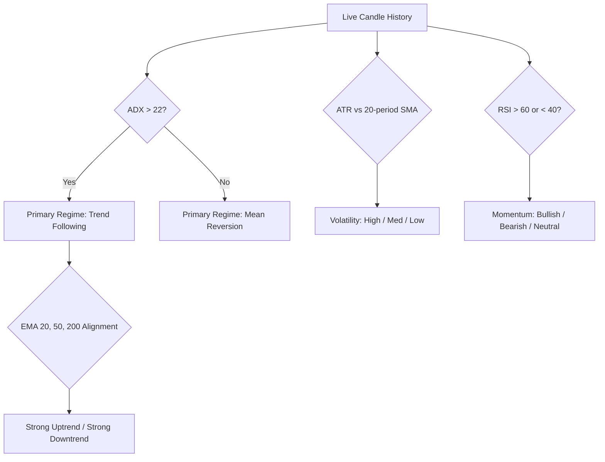

# Explanation: Market Regime Classification Theory

This document explains the financial and mathematical theory underlying Meta-Marker's deterministic market regime classification.

---

## 1. The Flaw of Static Indicators

Most algorithmic strategies fail over time because they apply static indicator rules across changing market regimes:
- **Trend-Following Indicators (e.g. Moving Average Crosses):** Highly profitable during sustained directional expansion, but suffer catastrophic drawdowns during sideways consolidation due to repetitive false breakouts ("whipsaws").
- **Oscillators (e.g. RSI, Stochastic):** Highly effective at identifying reversal bounds in mean-reverting ranges, but fail catastrophically during strong directional trends where price remains "overbought" or "oversold" for extended periods.

Meta-Marker resolves this by decoupling **Regime Detection** from **Indicator Weighting**.

---

## 2. Multi-Dimensional Regime Classification

Meta-Marker classifies the market across three orthogonal dimensions:

### 1. Primary Regime
- **Trend Following (`ADX > 22`):** Directional velocity is dominant. Moving averages and Break-of-Structure (BOS) signals are granted high weighting, while counter-trend oscillators are damped.
- **Mean Reversion (`ADX <= 22`):** Price is oscillating within boundaries. Bollinger Bands and Stochastic extremes take priority, while trend continuation signals are penalized.

### 2. Volatility State
- **High Volatility:** Current ATR exceeds $1.2 \times$ its 20-period moving average. Stop-loss distances are dynamically expanded to avoid noise stops.
- **Low Volatility:** ATR is below $0.8 \times$ average. Bollinger Band squeezes signal imminent expansion.

### 3. Momentum State
- Derived from RSI 14 velocity:
  - `RSI > 60`: Bullish Momentum
  - `RSI < 40`: Bearish Momentum
  - `40 <= RSI <= 60`: Neutral Momentum
